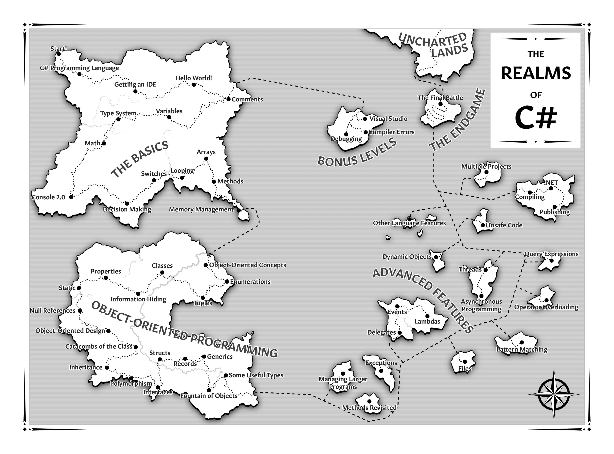

# The-CSharp-Players-Guide---Robert-s-run

This Repository contains my journey through R.B. Whitakers Book "The C# Player's Guide".

## Important

Part I was solely procedural programming and these exercixes were archived as .txt files but are not included in this repo.
A few exercises of early Part II are missing but there should be traces of them in the commits. I think one time while force-pulling this repo, it might have deleted them.

28-2-TheOldRobot was saved in 27-1-PackingInventory folder!

The larger Final Exams and Bossbattles of each Part were made as separate public repositories.

## Images

### Full Map

(Copyright for this picture belongs to R.B. Whitaker)

## Current Position: Part III - Operator Overloading

